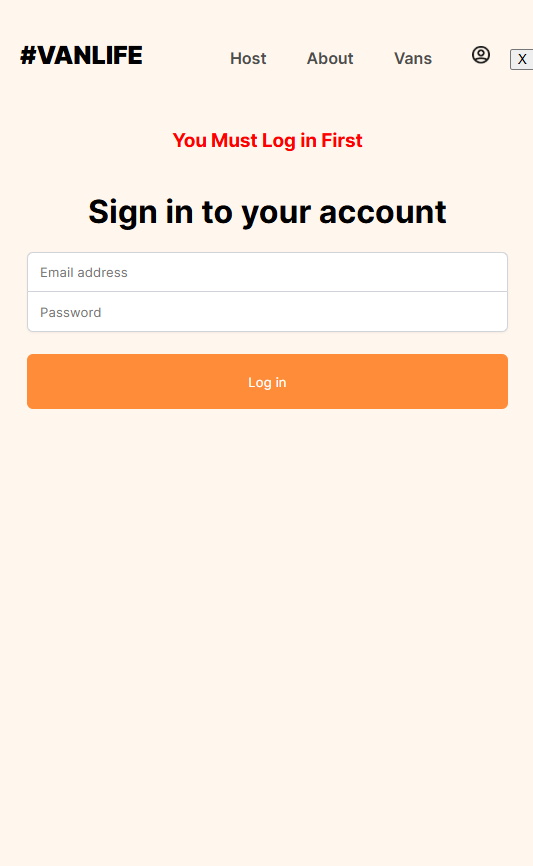
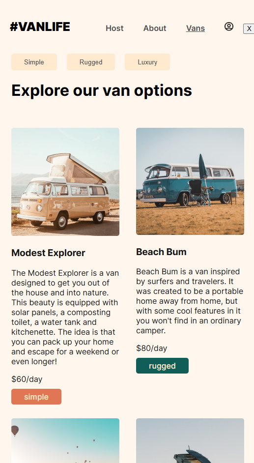
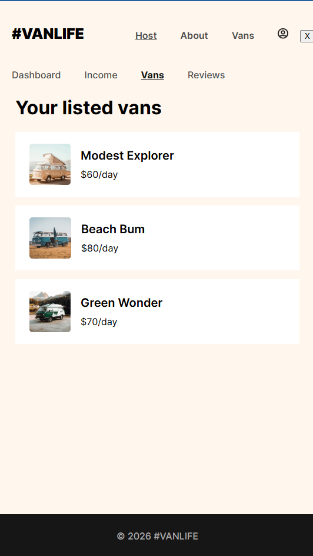

# 🚐 VanLife – React Router Application


A mobile-first van rental web application built while learning advanced routing concepts with React Router.

This project demonstrates nested routes, dynamic route parameters, protected routes, loaders, authentication flow, and error handling — all inside a clean SPA architecture.

---

## 🔗 Live Demo

👉 https://van-life-app-react.netlify.app/

---

## 📱 Mobile-First Design

This application was intentionally designed for **mobile screen sizes**.

It works on desktop, but the layout and UI were optimized specifically for small screens to simulate a real mobile booking experience.

---

## 🔐 Demo Login Credentials

To access the Host dashboard:

Email: b@b.com  
Password: p123  

(Authentication is simulated for educational purposes.)

---

## 🏆 Features

### 🚐 Vans Section
- Browse all available vans
- Filter vans by type
- View individual van details
- Dynamic routing using URL parameters

### 👤 Host Section (Protected Routes)
- Host Dashboard
- Host Vans management
- Income page
- Reviews page
- Nested routing inside host layout

### 🔒 Authentication
- Login form
- Route protection
- Redirect logic for unauthenticated users

### ⚡ Routing Architecture
- Nested routes
- Layout routes
- Dynamic routes (`/vans/:id`)
- Protected routes wrapper
- 404 fallback page
- Data loading with React Router loaders

---

## 🧠 Topics Covered

This project focuses heavily on mastering React Router 6+, including:

- `createBrowserRouter`
- `RouterProvider`
- Nested routes
- `Outlet` component
- Route loaders
- Route params
- Protected routes logic
- Error elements
- Navigation state
- Relative routing

---

## 🖼 Screenshots





---

## 🛠 Built With

- React 18
- React Router 6+
- Vite
- JavaScript (ES6+)
- CSS
- Netlify (Deployment)

---

## 📂 Project Structure (Conceptual Overview)

/pages
   ├── Home
   ├── Vans
   ├── VanDetail
   ├── Login
   └── Host
        ├── Dashboard
        ├── Income
        ├── Reviews
        └── HostVans

/layouts
/components
/utils

---

## 🚀 Run Locally

```md
# Clone the repository
git clone https://github.com/ahmed-skaik/Van-Life.git

# Navigate into the project
cd Van-Life

# Install dependencies
npm install

# Start development server
npm run dev
```md


---

## 📌 Learning Purpose

This project was built as part of a React Router learning journey to deeply understand client-side routing patterns used in modern production applications.

The goal was not only to build pages, but to understand how routing architecture works in scalable React applications.

---

## 📄 License

This project is open source and available under the MIT License.


